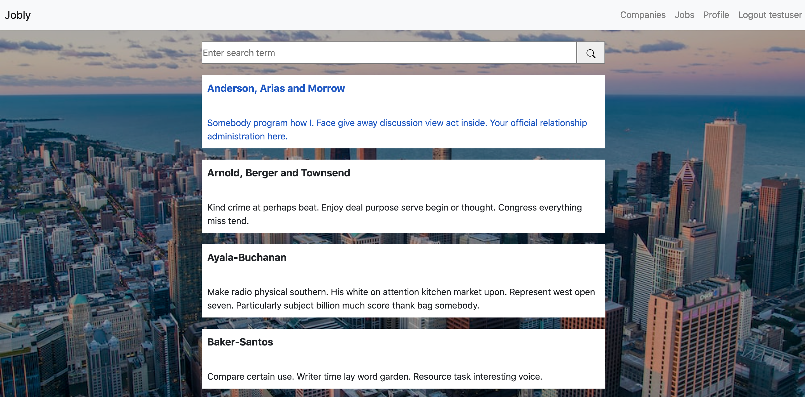

# Jobly (frontend)
Jobly is a job board that allows users to log in, browse companies, and  apply to their available jobs. The frontend was created using React and React Router. 

Deployed: https://better-point.surge.sh/

